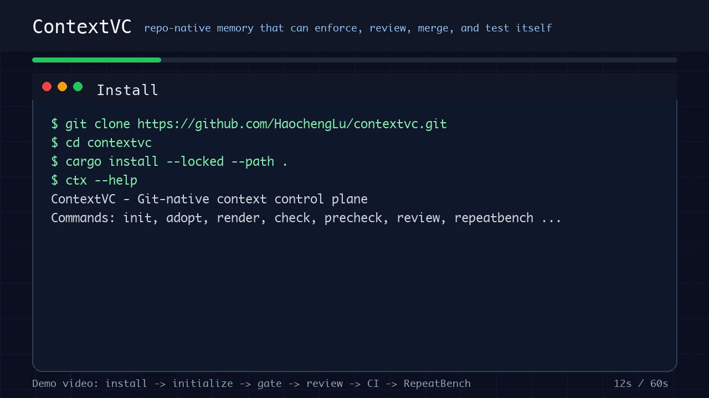
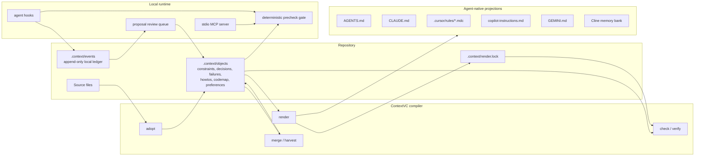

# ContextVC (`ctx`)

ContextVC is a Git-native context control plane for AI coding agents.

It stores project rules, decisions, failure memory, how-tos, preferences, and code maps inside `.context/`, then renders them into the native files used by Claude Code, Cursor, Codex, GitHub Copilot, Gemini, and Cline.

In one line: **agent memory becomes repo-level infrastructure that can be versioned, reviewed, merged, checked in CI, and enforced before risky actions.**

[](assets/demo.mp4)

Watch the [1-minute demo video](assets/demo.mp4).

## Why This Exists

AI coding tools already have many places to put memory: prompts, rule files, chat summaries, vector stores, local preferences, and session logs.

Those systems help an agent remember, but they usually do not answer the engineering questions a repository needs:

- Did this memory go through review?
- Does it follow the branch and the pull request?
- Is the generated agent-facing file still in sync?
- Is the rule stale because the source file changed?
- Can a known-bad command be stopped before the agent runs it again?
- Can CI prove the context is healthy?
- Can two branches merge context without silently losing semantics?

ContextVC is built for those questions.

## Install

Install the tagged release from GitHub:

```bash
cargo install --locked --git https://github.com/HaochengLu/contextvc.git --tag v0.1.0
ctx --help
```

Or clone and install from source:

```bash
git clone https://github.com/HaochengLu/contextvc.git
cd contextvc
cargo install --locked --path .
ctx --help
```

You need the Rust stable toolchain. If Rust is not installed, install it from [rustup.rs](https://rustup.rs/).

## Quick Start

Inside any repository:

```bash
ctx init --install-hooks
ctx status
ctx check
```

This creates `.context/`, renders agent-facing files, installs local hook adapters, and writes MCP configuration.

Generated files can include:

```text
.context/
AGENTS.md
CLAUDE.md
.cursor/rules/*.mdc
.github/copilot-instructions.md
GEMINI.md
.cline/memory-bank/contextvc.md
.mcp.json
```

ContextVC is local-first:

- no API key required
- no hosted service required
- no source upload
- local stdio MCP server
- long-lived context lives in the repo and can be reviewed with Git

## What Traditional Memory Management Does Not Have

Traditional memory management usually treats memory as a summary, a vector record, a user preference, or a private agent history. ContextVC treats memory as a repository control plane.

| Traditional memory usually lacks | ContextVC provides |
| --- | --- |
| Memory does not follow the repo | Durable objects live in `.context/objects/` and move with branches, pull requests, clones, and forks |
| Memory can be recalled but not enforced | `ctx precheck`, MCP, and hooks return `warn`, `ask`, or `block` before risky actions |
| Memory writes skip review | Runtime learning creates proposals; `ctx review accept` is required before formalizing them |
| Memory does not know when code changed | file/source bindings store hashes; `ctx check` detects stale bindings |
| Every agent owns a separate rule file | `.context/` is the source of truth; `ctx render` compiles native files for many agents |
| Retrieval cannot prove generated files are current | `render.lock`, schema validation, and managed-block drift checks run in CI |
| Branch conflicts are vague | `ctx merge` and `ctx harvest` persist semantic conflicts; conflicted constraints fail closed |
| Rollback is manual | `ctx blame`, `ctx diff`, and `ctx revert` use Git semantics for context objects |
| Clients can spoof event identity | MCP `context_log` rebuilds server-owned fields and redacts secrets |
| It is hard to measure whether memory prevents repeats | RepeatBench verifies that known failures are caught while safe actions still pass |

## Core Features

| Capability | Command / file | What it does |
| --- | --- | --- |
| Initialize context | `ctx init` | Creates `.context/`, projection files, and lockfile |
| Adopt existing rules | `ctx adopt` | Imports `AGENTS.md`, `CLAUDE.md`, and Cursor rules into objects |
| Backfill codemap | `ctx backfill` | Builds codemap objects from Git history |
| Render projections | `ctx render` | Generates native agent files while preserving human-written regions |
| CI guard | `ctx check` | Detects projection drift, stale bindings, schema errors, conflicts, and bad events |
| Project brief | `ctx brief` | Prints concise context for an agent task |
| MCP runtime | `ctx serve-mcp` | Serves local tools for brief, search, precheck, log, propose, and status |
| Hook install | `ctx install` | Installs Claude / Cursor / Codex hooks, MCP config, and Git hooks |
| Pre-action gate | `ctx precheck` | Checks commands or paths against constraints and failure memory |
| Gate snooze | `ctx snooze` | Locally suppresses a specific gate hit |
| Failure writeback | `ctx log-event` / `ctx hook stop` | Distills runtime failures into proposals |
| Human review | `ctx review` | Accepts or rejects proposals before they enter the source of truth |
| Staleness check | `ctx verify` | Validates object bindings against current file/source hashes |
| Semantic merge | `ctx merge` / `ctx harvest` | Preserves semantic conflicts and blocks conflicted constraints |
| Git history | `ctx log` / `ctx blame` / `ctx diff` / `ctx revert` | Tracks and rolls back context objects with Git semantics |
| Diagnostics | `ctx doctor` | Checks config, lockfile, hooks, schema, and possible secrets |
| Schema | `ctx schema` | Prints or writes the OCL object JSON Schema |
| Benchmark | `ctx repeatbench` | Runs repeat-failure gate scenarios |

## Architecture



The same diagram is also available in [docs/architecture.mmd](docs/architecture.mmd).

## Three Real Workflows

### Workflow 1: Bootstrap an Existing Repository

Use this when a repository already has agent rules spread across files.

```bash
cd your-repo
ctx init --skip-adopt
ctx adopt
ctx render --force
ctx check
ctx install all
```

What happens:

- existing agent instructions are imported into `.context/objects/`
- native projection files are regenerated from one source of truth
- hooks and MCP config are installed locally
- CI can run `ctx check` to detect drift

### Workflow 2: Stop a Repeated Bad Command

Create a constraint once and let all supported agents consume it.

```bash
mkdir -p .context/objects/constraints
cat > .context/objects/constraints/use-pnpm.md <<'EOF'
---
id: c-usepnpm
type: constraint
title: Use pnpm
scope: ["**"]
status: active
trust: human
confidence: 1.0
evidence: []
bindings:
  - kind: command
    pattern: "npm install"
    enforcement: block
created: init
---

Use `pnpm install`; do not run `npm install` in this repository.
EOF

ctx render --force
ctx check
ctx precheck --command "npm install"
```

Expected behavior:

- `ctx render` projects the constraint into agent-native files
- `ctx precheck` returns a blocking gate hit for `npm install`
- safe commands that do not match the constraint are not blocked

### Workflow 3: Turn a Failure Into Reviewed Memory

Use the review queue instead of letting runtime learning silently mutate the source of truth.

```bash
ctx log-event \
  --event-type failure \
  --payload '{"target":"src/parser.rs","action":"cargo test parser","outcome":"failed","evidence":"parser fixture failed"}'

ctx hook stop
ctx review list
ctx review accept <proposal-id>
ctx render --force
ctx check
```

What happens:

- the failure event is appended locally
- a proposal is generated from repeated or meaningful evidence
- a human accepts or rejects it
- accepted memory becomes a formal `.context/objects/` file
- projections and lockfile are regenerated

## RepeatBench Results

RepeatBench checks whether known repeat failures are caught by the gate while false-positive actions remain safe.

Latest committed summary: [benchmarks/repeatbench/results/latest-summary.json](benchmarks/repeatbench/results/latest-summary.json)

```json
{
  "scenarios": 1,
  "gate_hits": 1,
  "misses": 0,
  "repeat_failure_rate": 0.0
}
```

Raw per-scenario output is stored at [benchmarks/repeatbench/results/latest.json](benchmarks/repeatbench/results/latest.json).

Run it yourself:

```bash
ctx repeatbench --json
ctx repeatbench --json --output benchmarks/repeatbench/results/latest.json
```

## CI

Use ContextVC as a repository health check:

```bash
ctx check
```

The included GitHub Actions workflow runs:

```bash
cargo fmt --all -- --check
cargo test --all --locked
cargo build --release --locked
target/release/ctx repeatbench --json
git diff --check
```

`ctx check` fails on:

- missing `.context/VERSION` or `render.lock`
- object changes that were not rendered
- edited managed blocks
- stale file/source bindings
- invalid object schema fields
- corrupt event JSONL
- conflicted constraints

## Object Model

ContextVC stores durable knowledge as Markdown files with OCL frontmatter.

Object types:

- `constraint`: hard or soft rule, often enforced by path or command
- `decision`: architectural or implementation decision
- `failure`: repeated failure or known pitfall
- `howto`: task recipe
- `codemap`: important source area or high-churn file
- `preference`: style, testing, formatting, or workflow preference

Managed projection files use `ctx:begin` / `ctx:end` blocks. Human-written text outside those blocks is preserved by `ctx render`.

## Local Security Boundaries

- ContextVC reads and writes the current repository and local config files.
- Events and objects are redacted for common secret patterns before saving.
- MCP `context_log` does not trust client-supplied actor/id fields.
- Binding paths reject absolute paths, parent traversal, out-of-repo symlinks, and oversized files.
- Review accept uses preflight checks and render rollback.
- Conflicted constraints fail closed.

## Development

```bash
cargo fmt --all
cargo test --all
cargo build --release
target/release/ctx repeatbench --json --output target/repeatbench-results.jsonl
git diff --check
```

## Release

The first public tag is `v0.1.0`.

```bash
git fetch --tags
git checkout v0.1.0
cargo install --locked --path .
```

## License

Apache-2.0. See [LICENSE](LICENSE).
